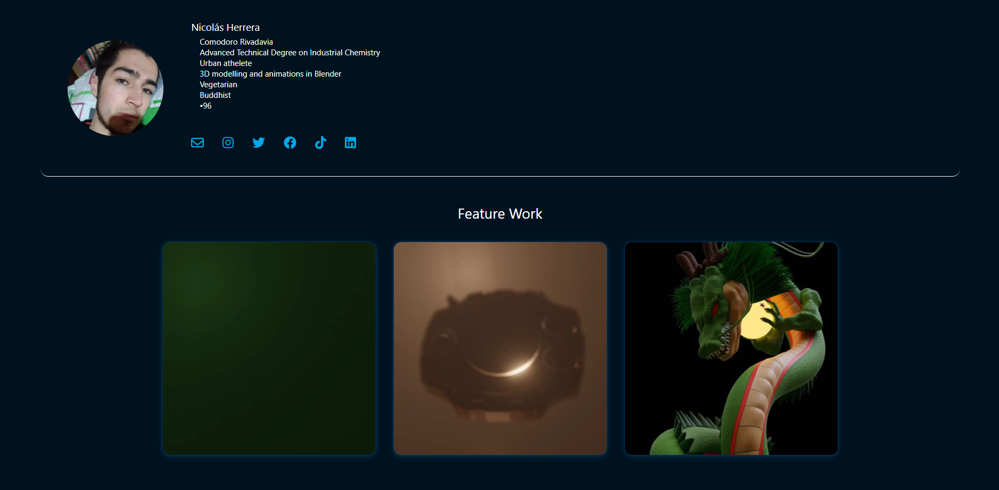
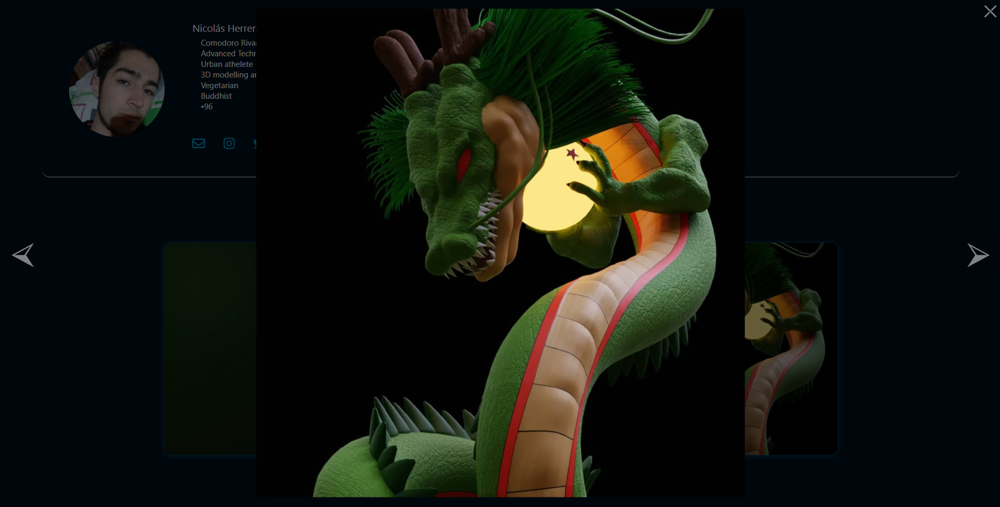
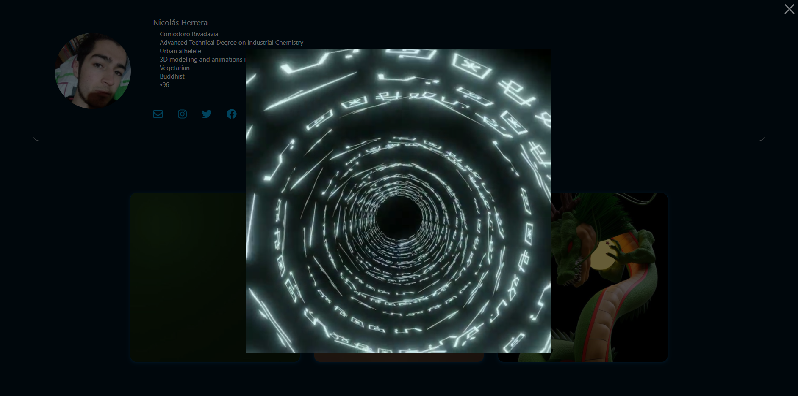
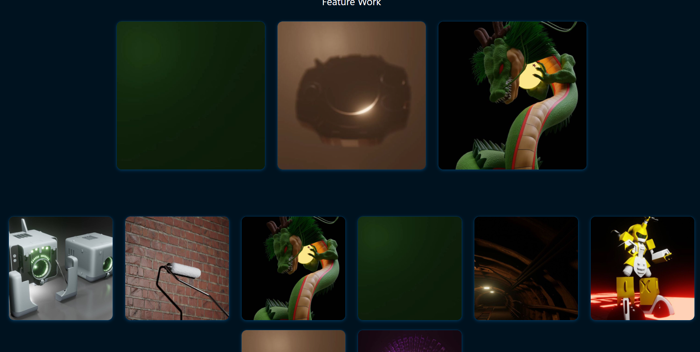

# portfolio-from-instagram

ReactApp that use your Instagram profile to make a porfolio page
For it o work you need the username and the Query_hash (https://dev.to/praneetloke/roll-your-own-instagram-gallery-in-5-mins-3fjf)

## Features

- It let you filter post by hashtags eg: #Art , it's case sensitivy so be carefull with that.
- Filter by type of content eg: only show videos or everything but videos.
- You can use a custom name or bio insted of the one on instagram.
- It ahs a section called feature post that contains the top 3 more liked post (from the first 12) or you can add custom post instead.

## Dependencies

- npm i --save react-native-svg # \*\*
- npm i -S @fortawesome/free-regular-svg-icons
- npm i -S @fortawesome/free-solid-svg-icons
- npm i -S @fortawesome/react-fontawesome
- npm i -S @fortawesome/free-brands-svg-icons
- path-browserify

## Cons

Instagram changes its API regulary so i dont know for how low this is going to last. In adition making to much request to instagram forces you to log in or stops giving you more information and i dont know how to fix that.

## Pictures

